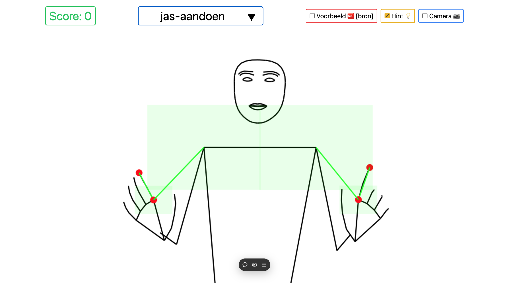

# Smog leren voor kinderen



[Smog leren voor kinderen](https://smog-leren-voor-kinderen.vercel.app/) is a site that teaches gestures to children with communication disabilities that they can use while speaking Dutch to express themselves more clearly.

It is a proof of concept that was developed for the purpose of a thesis by Laura Landuyt. The gestures are taken from [SMOG & Co](https://smog.vlaanderen/). Only a small number of gestures are currently supported.

Pose detection is done using the holistic landmarks detection solution from Google AI. See
[the holistic landmarks detection task guide](https://ai.google.dev/edge/mediapipe/solutions/vision/holistic_landmarker), [the related github document](https://github.com/google-ai-edge/mediapipe/blob/master/docs/solutions/holistic.md) and [the legacy solutions overview](https://ai.google.dev/edge/mediapipe/solutions/guide#legacy) for more information.

## Installation

Use the package manager [npm](https://docs.npmjs.com/) (preferrably using [nvm](https://github.com/nvm-sh/nvm)) to install the dependencies.

```bash
npm install
```

## Usage

For developement:

```bash
npm run dev
```

For production:

```bash
npm run build
```

Deploy to Vercel:

[](https://vercel.com/new/clone?repository-url=https%3A%2F%2Fgithub.com%2Fbraekevelt%2Fsmog-leren-voor-kinderen)

## Contributing

This project is no longer under active development and only serves as a example implementation for others now.

Pull requests with small fixes or additional gestures are welcome. For major changes, please fork the repository and continue on your own.

## License

[MIT](https://choosealicense.com/licenses/mit/)
